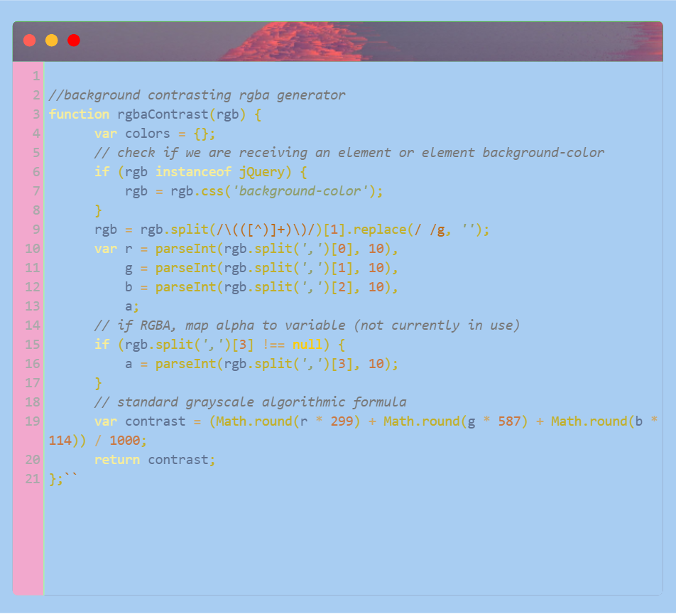
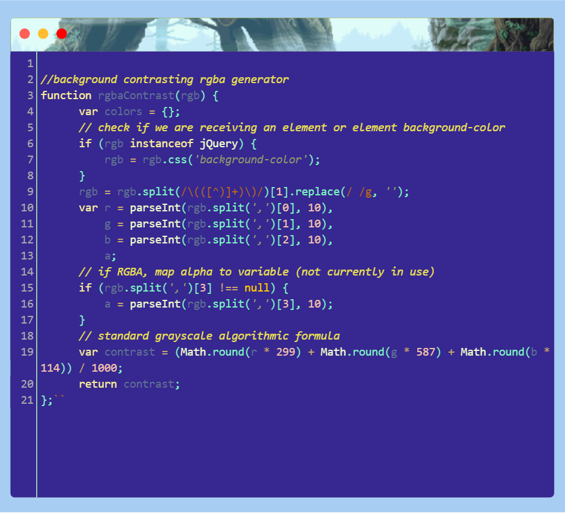

<a name="table-of-contents"/>

## sparkup 

###### Customizable Screenshot Canvas

<a name="demo"/>

###### The Result

-----------------

<a name="features"/>

- syntax highlighting for different languages
- automatic indenting, error checking, and parenthesis completion
- diff checker
- refrence manuals for built in functions of different languages
- psuedo interpreter/compiler
- quake terminal control interface with command memory, help, clear, etc.
- random color schemes from complementary color scheme algorithm
- automatic contrast text color
- cycle through random picture, video or color scheme backgrounds for canvas, border, or background
- export, download, and save work

-----------

<a name="examples"/>

###### Example Screenshots . . .

----------------------------

  

    Made with <g-emoji class="g-emoji" alias="heart" fallback-src="https://github.githubassets.com/images/icons/emoji/unicode/2764.png">
  </g-emoji> <a href="https://www.bymyself.life">bymyself</a>
  

  

<a href="#table-of-contents">Top (目次)</a>
 