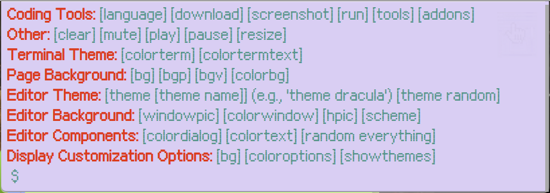
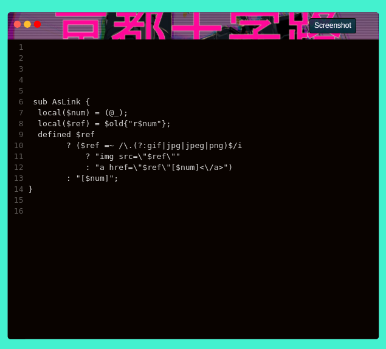

<a name="table-of-contents"/>

## sparkup 

###### TODO:
- fix all language selections
- add list of add-ons & test/fix all
- cookies
- fix clock glitch rate
- optimize bg video upload rate/size (load first also?)
- download function -> save canvas
- contact button
- new demo across multiple webp files

###### Customizable Screenshot Canvas

<a name="demo"/>

###### The Result

-----------------

<a name="features"/>

- syntax highlighting for 40+ languages
- automatic indenting, error checking, parenthesis completion, match tags
- comment out chunks, linters, section folding
- keymaps for emacs, vim, sublime, psuedo interpreter/compiler
- quake terminal control interface with command memory, help, clear, etc.
- library of common editor themes
- random color schemes from complementary color scheme algorithm 
- automatic contrast text color
- cycle through random picture, video or color scheme backgrounds for canvas, border, or background
- export, download, save, screenshot

<a name="options-demo"/>

###### Options *(display with help command)*

-----------

<a name="examples"/>

###### Example Screenshots . . .

----------------------------

  

    Made with <g-emoji class="g-emoji" alias="heart" fallback-src="https://github.githubassets.com/images/icons/emoji/unicode/2764.png">
  </g-emoji> <a href="https://www.bymyself.life">bymyself</a>
  

  

<a href="#table-of-contents">Top (目次)</a>
 
